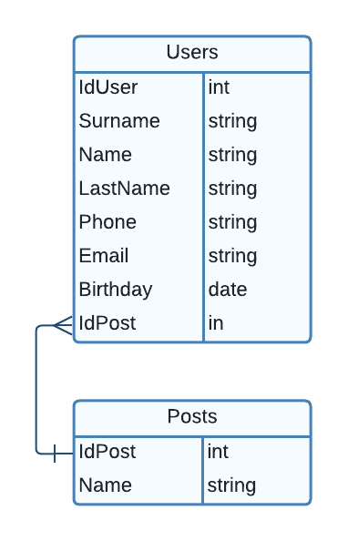

# СУБД "Кадры"  
Это программа разработанная за период практики, предназначенная для хранения и обработки кадров предприятия.  
# Схема базы данных  
  
# Установка  
Файл ``setup.exe`` установит данную программу на ваш компьютер  